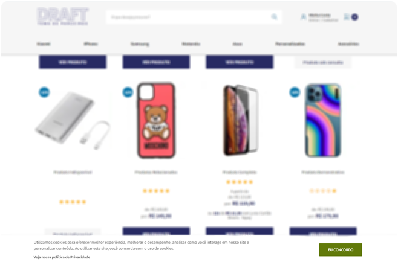
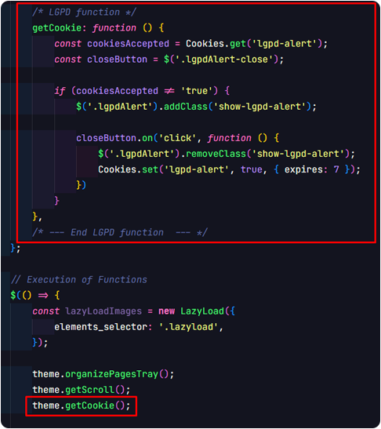

<h1 align="center">
    <br>
    
    <br>
</h1>
<br>
<p align="center">Esse componente contem todo o código necessario para ser usado corretamente dentro do <b>Tema de Parceiros</b> Draft, criado do total zero sem heranças de outros temas, bem testado, seguindo o Design System do tema.

<div align="center" >
    
</div>
<br>
<br>

## ⚙️ Requisitos
Foi utilizado a lib <b>js-cookie</b> que é simples e fácil de utilizar.

Sugiro que leia a documentação para os metodos de instalação e opções de configurações.

🔗 Link: https://github.com/js-cookie/js-cookie


## ℹ️ Como Usar

<p>Dentro da pasta do componente existem outras que segue a mesma estrutura do tema e é aonde cada arquivo tem que estar para que o alerta funcione, por exemplo:</p>

#### 📁 <b>extras/alerta-lgpd/.sass/_alert-lgpd.scss</b>
- Copiar e colar esse arquivo e arrastar para dentro da estrutura do tema que segue o mesmo caminho.
- No final do arquivo "style.scss" em baixo do comentário "Imports of SASS parts" importar o arquivo:
```scss
'elements/alert-lgpd'
```
---
#### 📁 <b>extras/alerta-lgpd/configs/settings.html</b>

- Copiar o html dentro deste arquivo e encaixar dentro da área deseja no Settings e nele contém:

  - [X] Opção para ativar/desativar alerta de Política de Privacidade.
  - [X] Possibilidade de mudar a mensagem do alerta de Política de Privacidade.
  - [X] Possibilidade de colocar link da sua página de Política de Privacidade.

- Chamar o snippet no "default.html"
    ```twig
    {# alert lgpd #}
    
    ```
---
#### 📁 <b>extras/alerta-lgpd/snippets/lgpd-alert.html</b>
- Copiar e colar esse arquivo e arrastar para dentro da estrutura do tema que segue o mesmo caminho.
---
#### 📁 <b>extras/alerta-lgpd/js/alerta-lgpd.js</b>
- Contém:

  - [X] Script necessário para que funcione corretamente.
  - [X] Ao usuário "Aceitar", será salvo no Cookies por tantos dias definido no script, assim impossibilitando do alerta aparecer toda vez que ele atualizar a página.

- Dicas:

  - No arquivo "gulpfile.js" tem uma função "concatLibsJs", você pode colocar essa lib lá também.
  - No arquivo "main.js" você pode colocar essa função no final do escopo aonde estão chamando todas as funções e chamar aonde executa as funções
    <div align="left" >
        
    </div>
---
