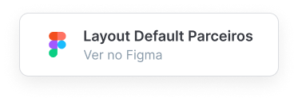

<h1 align="center">
    <br>
    
    <br>
</h1>
<br>
<p align="center">Esse repositório contem o código do <b>Tema de Parceiros</b> Draft, atualmente na versão <b>1.0.0</b></p>
<p align="center"> Visualize o tema na loja:
    https://demo-partners-theme.commercesuite.com.br/
</p>

<div align="center" >
    
</div>
<br>
<br>
<div align="center">
    <a href="https://www.figma.com/file/HUThrLq4Pxx9Rrj9m6Tc99/Draft---Theme-Default---P%C3%BAblico?node-id=0%3A1" target="_blank" rel="noreferrer noopener" title="Abrir Layout do Tema no Figma">
        
    </a>
</div>


## ⚡ Tecnologias

-   **HTML**
-   **CSS**
-    **JavaScript**
-    **SASS**


## ℹ️ Como Usar

#### ⚙️ Requisitos

-   Git
-   Gulp
-   Node JS


#### Iniciando o Desenvolvimento

```
# Instalar dependências:
npm install

# Instalar o Gulp (caso não o possua em sua máquina):
npm install --global gulp-cli

# Assistir a modificação dos arquivos em tempo real, compilando e minificando os arquivos necessários:
gulp

# Commit para o repositório:
npm run commit
```


#### Para produção

```
# Faz o build para produção, compilando e minificando os arquivos necessários:
gulp build
```


## :octocat: Contribua

Todos os tipos de contribuições são muito bem-vindas e apreciadas!

-   ⭐️ Estrelar o projeto
-   🐛 Localizar e relatar problemas
-   📥 Enviar PRs para ajudar a resolver problemas ou adicionar recursos
-   ✋ Influenciar o futuro do projeto com solicitações de recursos


## 🔖 Licença

Este projeto está licenciado sob a [GPLv3](LICENSE).

<p align="right"><kbd><b>
    <a href="#top">VOLTE PARA O TOPO 🔝</a>
</b></kbd></p> 
